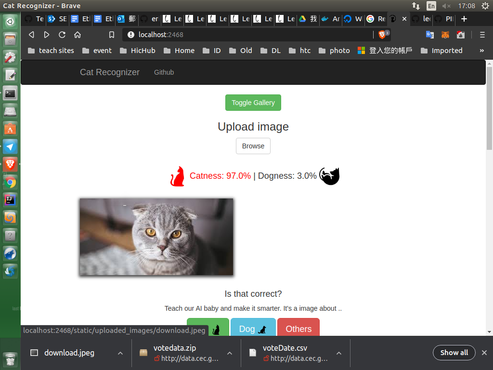

https://github.com/leemengtaiwan/cat-recognition-app  
https://leemeng.tw/3-ways-you-can-leverage-the-power-of-docker-in-data-science-part-1-learn-the-basic.html   

docker pull leemeng/cat  
docker run -it -p 2468:5000 leemeng/cat  

[Browser]localhost:2468  

